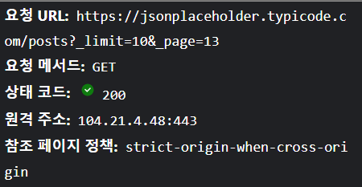

# infinite scroll

> 이번에는 `Throtte`의 가장 유명한 예시인 무한 스크롤을 구현해보자.

-   무한스크롤 구현
-   컨텐츠의 끝이 화면 끝에 닿으면 api가 호출되게 구현
-   todolist 와 달리 외부 api 연동
-   fetch, async, await

<hr/>

## 목차

-   <a href="#api">API 연동</a>
-   <a href="#problem">문제 기록</a>

## <a id="api">API 연동</a>

https://jsonplaceholder.typicode.com/

-   프로토타이핑용 api
-   /posts 활용
-   [json-server](https://www.npmjs.com/package/json-server) 만든 곳에서 만들었기 때문에 사용 방법은 json-server와 동일

## <a id="problem">문제 기록</a>

### Script에서 한번에 Element추가하기 - CSS안먹힘

```javascript
const loadPost = async () => {
    const posts = await getPost();
    console.log(posts);
    for (let post of posts) {
        let html = `<li class="item">
                <div className="header">
                <span className="index">${post.id}.</span>
                <h2 className="item_title">${post.title}</h2>
                </div>
                <p className="desc">${post.body}</p>
            </li>`;
        $items.innerHTML += html;
    }
};
```

해당 코드를 적용해서 `$items`에 불러온 post들을 작성한 css의 class에 맞게 작성해서 `$items.innerHTML`에 넣어주었는데 CSS가 적용되지 않는 문제가 발생..

➡️ ...VScode에서 제공해주는 자동완성 기능을 너무 믿었던 나머지 실수를 범함... `className`이 아니라 `class`라고 작성해야하는것을..ㅎ..ㅎ.. 아 .. ㅎㅎ😂😂

### 무한 스크롤도 throttle이 필요하다!!

무한 스크롤에서 스크롤의 위치를 감지하는데, 이 때문에 결국 무한 스크롤에서도 스크롤의 위치를 감지하기 위해 스크롤이 발생할때마다 함수를 실행시키는구만 ? 바로 해결해보자🤗

### 무한 스크롤 개수 제한 - 끝나도 계속 요청하네?


jsonplaceholder에서 제공하는 데이터는 총 100개지만, \_page가 10이 넘어가도 페이지 하단에 도착하면 계속해서 요청을 보냄.

이것도 마찬가지로 `X-Total-Count`에 접근해서 설정해주자.

### removeEventListener

https://developer.mozilla.org/ko/docs/Web/API/EventTarget/removeEventListener

-   scroll이벤트가 이제 더이상 필요없어졌지만, 계속해서 이벤트를 감지하고 있음
-   addEventListener()로 등록했던 이벤트 리스너를 제거
-   ✔️ 더이상 필요가 없는데 이벤트가 계속 발생하는 경우 메모리 누수가 일어날 수 있음
-   따라서 명시적으로 해제

```javascript
const throttle = (callback, time) => {
    if (!timerId) {
        timerId = setTimeout(() => {
            timerId = null;
            callback();
        }, time);
    }
};

const onScroll = () => {
    throttle(isEndScroll, 100);
};
```

throttle함수를 리턴하는 고차함수를 새로이 만들어서 removeEventListener에서 명시적으로 해제하지 못했던 화살표함수를 해제할 수 있도록 만듦.

### 느린 3G 환경에서...

해당 환경에서 스크롤을 가장 밑에 왔다 갔다 하게 되면 2번의 요청이 보내지는것을 확인했다.. 이를 어떻게 막을 수 있을까!

➡️ 답은 간단했다. `throttle함수` 안에서 setTimeout함수가 실행되면서 함께 timerId를 null로 했었는데, 이를 Promise가 끝난 후에 처리해주면 깔끔하게 해결이 가능하다.

네트워크를 확인해도 여러변 요청이 됐던것이 한번만 요청하게 된다!

### Desktop 환경에서...

스크롤이 동작하지 않는다.. 스크롤 높이와, 화면 높이, 총 높이를 확인해보니 앞 2개의 높이가 총 높이보다 크거나 같다는 조건에 만족하지 않았음.
때문에 총 높이에 -5px 정도로 값을 주게 되니 정상적으로 동작을 확인할 수 있었음.