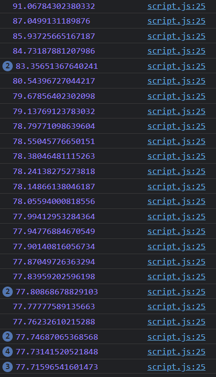
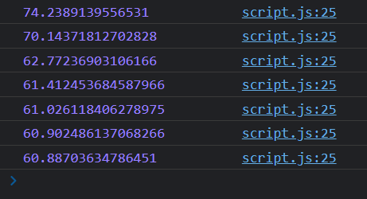

a# Progress Bar

## 목차

<ul>
<li><a href="#browser">브라우저 창의 너비와 높이</a></li>
<li><a href="#scroll">요소 사이즈와 스크롤</a></li>
<li><a href="#problems">문제 기록</a></li>
</ul>

> 블로그들을 보면 해당 페이지 내에 현재 내가 보고있는 부분이 페이지의 어디쯤인지 알려주는 바가 있어 한번 구현해본다.

https://ko.javascript.info/size-and-scroll-window

### <a id="browser">브라우저 창의 너비와 높이</a>


#### window객체가 아닌 document.documentElement를 쓰는 이유

브라우저의 `window`객체 역시 innerWidth와 innerHeight를 통해 창의 너비와 높이를 구할 수 있다고 알고 있는데 scroll이 있는곳에서는 `window`객체를 사용하지 않는다고 합니다.

스크롤바가 생기면 스크롤바 역시 공간을 차지하는데, `clientWidth`나 `clientHeight`는 스크롤바가 차지하는 공간을 제외해서 너비나 높이 값을 계산합니다. 때문에 눈에 보이는 문서에서 콘텐츠가 실제로 들어가게 될 영역의 너비와 높이값을 반환한다고 합니다.

https://ko.javascript.info/size-and-scroll

### <a id="scroll">요소 사이즈와 스크롤</a>


-   자바스크립트로 요소 사이즈나 스크롤 높이 등을 알 수 있음
-   주황색 보더를 기준
    -   보더 바깥쪽: offsetTop, offsetLeft
    -   보더 사이: clientTop, clinetLeft
    -   콘텐츠: clientWidth, clientHeight
    -   보더 포함한 콘텐츠: offsetWidth, offsetHeight
    -   콘텐츠의 전체 길이: scrollHeight
    -   스크롤바의 수직 위치: scrollTop

### <a id="problems">문제 기록</a>

#### 스크롤의 높이, 현재 스크롤 위치 구하기

<a href="#scroll">요소 사이즈와 스크롤</a>에서 확인했듯이

-   `현재 스크롤의 위치`는 scrollTop,
-   `스크롤의 높이`는 scrollHeight

라고 했었는데 아래의 결과에서 scroll의 위치에 상관없이 scrollTop의 값이 0으로 고정되어서 출력.

```javascript
const onscroll = () => {
    console.log("scrollTop: ", $content.scrollTop);
    console.log("scrollHeight: ", $content.scrollHeight);
    /* output
    scrollTop: 0
    scrollHeight: 4906
    */
};

window.addEventListener("scroll", () => onscroll());
```

➡️ 🤯 $content 자체에서 scroll이 생기는것이 아니라 html문서 자체에서 모니터의 크기에 따라 scroll이 생기는것이기 때문에 `document.documentElement`.scrollTop으로 접근해야했었다는것...

➡️

```javascript
const height = // scroll최대 길이 - client창의 높이
    document.documentElement.scrollHeight -
    document.documentElement.clientHeight;
const scrollTop = document.documentElement.scrollTop;
const width = (scrollTop / height) * 100;
```

### throttle & debounce

scroll이벤트가 발생할때마다 값을 계산하고, console로 찍어보니 너무 자주 함수가 호출되어 console창이 가득 차 버리는 현상이 발생한다. ➡️ 전에 이론상으로만 알아봤었던 최적화 기법 중 하나인 `throttle`과 `debounce` 기법을 사용해본다 

https://velog.io/@uiseop/JS-%EC%93%B0%EB%A1%9C%ED%8B%80%EB%A7%81%EA%B3%BC-%EB%94%94%EB%B0%94%EC%9A%B4%EC%8A%A4

- 시간이 지남에 따라 함수가 실행되도록 허용하는 횟수를 제어하는 방법

#### debounce

- debounce: 특정 시간이 지난 후 하나의 이벤트만 발생시키는 방법
- 예시) 버튼 중복 클릭 방지


#### throttle

- throttle: 일정한 주기마다 이벤트를 발생시키는 방법
- 예시) 스크롤 이벤트


##### Before
적용 전... 

##### After
적용 후...
