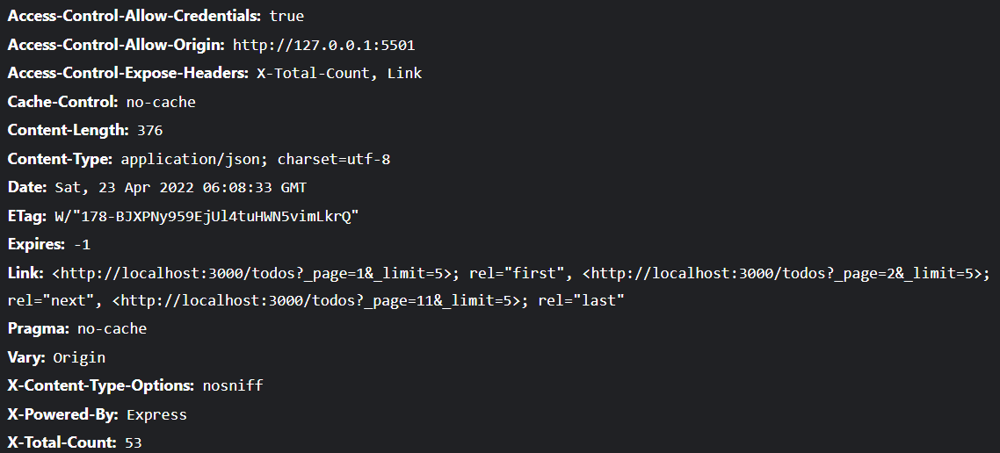

# Todo List

## 목차

<ul>
<li><a href="#json">Json-server</a></li>
<li><a href="#fetch">fetch API</a></li>
<li><a href="#problems">문제/이슈 기록</a></li>
</ul>

> `json-server`의 편리함을 확인하고, 간단한 CRUD 프로젝트를 제작해본다.

반응형 디자인을 오랜만에 만들어보면서 다시한번 공부하는 시간이 되었다.
Todo List의 디자인 경우 가운데 작은 노트패드같은 디자인으로 responsive한 width를 잡아주어야만 반응형 디자인이 가능.
어느정도 통일된 디자인을 제공하기 위해 `min/max- width`를 사용하면서 가변적인 너비를 `width: 50%`로 할당.

디자인적인 요소의 추가 - `box-shadow`에 대한 학습

```
/* offset-x | offset-y | color */
box-shadow: 60px -16px teal;

/* offset-x | offset-y | blur-radius | color */
box-shadow: 10px 5px 5px black;

/* offset-x | offset-y | blur-radius | spread-radius | color */
box-shadow: 2px 2px 2px 1px rgba(0, 0, 0, 0.2);

/* inset | offset-x | offset-y | color */
box-shadow: inset 5em 1em gold;

/* Any number of shadows, separated by commas */
box-shadow: 3px 3px red, -1em 0 0.4em olive;

출처: https://developer.mozilla.org/ko/docs/Web/CSS/box-shadow
```

## <p id="json">Json-server</id>

-   실제 배포시에는 사용되지 않고, 프로토타이핑이나 목업 데이터들을 사용한 `fake api` 작성시에 유용하게 사용된다고 한다.

-   혼자하는 프로젝트이기때문에 굳이 Backend까지 혼자 하기엔 프론트엔드를 학습하는데에 효율적이지 못하다는 판단으로 앞으론 요곳을 요긴하게 사용해보도록 한다.

-   npm으로 손쉽게 설치가 가능해.
    -   https://github.com/typicode/json-server

```
npm install -g json-server // 설치 커멘드
npm list -g // global적으로 설치된 npm 확인
/* output
...
├── json-server@0.16.3
├── nodemon@2.0.15
├── npm@7.21.1
├── sass@1.50.0
...

그런 후 db.json파일을 생성하고 안에 json형식으로 데이터를 추가한다.
ex)
    {
    "posts": [
        { "id": 1, "title": "json-server", "author": "typicode" }
    ],
    "comments": [
        { "id": 1, "body": "some comment", "postId": 1 }
    ],
    "profile": { "name": "typicode" }
    }
*/

json-server --watch db.json // json-server를 실행
```

-   json-server를 사용하면 `filter`나 `pagination`같은 기능도 사용할 수 있다고 해. 직접 만들때는 살짞 빡🤯이 쳤던것같았는데 손쉽게 만들 수 있겠다👏👏

## <p id="fetch">fetch API 정리</p>

https://developer.mozilla.org/ko/docs/Web/API/Fetch_API

-   AJAX 요청을 하기 위한 기술
-   AJAX란 서버에서 추가 정보를 비동기적으로 가져올 수 있게 해주는 포괄적인 기술을 나타내는 용어
-   XHR, JQuery, Fetch 등의 선택지가 있지만 이번 강의에서는 최신 기술인 fetch API를 사용

#### fetch API 사용법

https://developer.mozilla.org/ko/docs/Web/API/Fetch_API/Using_Fetch

-   fetch api의 response는 실제 json 이 아니다.
-   따라서 fetch api에서는 추가 메서드를 호출해 응답 본문을 받을 필요가 있다. (`.json()`)
    -   axios는 이 과정을 자동으로 해주기 떄문에 바로 response를 받을 수 있다.
-   body 데이터 타입은 헤더의 content-type 헤더와 일치해야 한다.

```
var url = 'https://example.com/profile';
var data = {username: 'example'};

fetch(url, {
  method: 'POST', // or 'PUT'
  body: JSON.stringify(data), // data can be `string` or {object}!
  headers:{
    'Content-Type': 'application/json'
  }
}).then(res => res.json())
.then(response => console.log('Success:', JSON.stringify(response)))
.catch(error => console.error('Error:', error));

```

## DOMContentLoaded

https://developer.mozilla.org/ko/docs/Web/API/Window/DOMContentLoaded_event

-   초기 HTML 문서를 완전히 불러오고 분석했을 때 발생

```
window.addEventListener('DOMContentLoaded', (event) => {
    console.log('DOM fully loaded and parsed'); // 여기서는 console이 찍히겠군.
});
```

## <p id="problems">문제 기록</p>

-   ### DOM접근 문제

    -   개별 checkbox의 class명인 `.todo_checkbox`에 접근하지 못함
    -   `이유`: DOM이 Loaded된 시점에서 비로서 서버와 통신하여 데이터들을 받아오고, `getTodos`함수를 통해 요소들을 만들기 때문에 곧바로 `.todo_checkbox`에 접근하지 못함
    -   해결: JS의 `이벤트 버블링🐳`을 사용하여 해결하자. 부모 요소 `.todos`에서 이벤트를 처리한다.

    ```javascript
    const editTodo = (e) => {
        console.log(e.target.className); // className을 통해 어느 요소를 클릭했는지 확인.
        if (e.target.className === "todo_checkbox") {
            const $todo = e.target.closest(".todo"); // 자신부터 부모 요소 단위로 출발하여 가장 가까운 .todo 요소를 찾는다.
            const id = $todo.dataset.id; // dataset으로 지정해서 js에서 불러올 수 있음.
        }
    };
    ```

-   ### 텍스트 수정시 Focus처리

    -   텍스트 수정 버튼 눌렀을 때 focus() 메서드를 주어도 커서가 맨 앞에 위치함.
    -   구글링 결과 Input의 value를 비워주고, 다시 채우면 커서가 뒤로 밀려난다고 하는군!

-   ### 텍스트 수정 취소시 Input데이터

    -   수정 취소해도 Input이 이전에 변경하던 내용을 담고있음
    -   label의 innerText는 이전의 데이터를 갖고있기때문에 이를 참조함.

-   ### 버튼 클릭 이벤트 범위 수정

    -   이벤트 버블링의 타겟을 `className === ...`으로 설정하다보니 className 자식요소인 icon을 감지하지 못하는 문제 ➡️ console을 찍어보니 icon클릭에 이벤트를 넣어주지 않음 ➡️ classList[0]으로 접근해서 icon일 경우에도 동일한 이벤트 처리효과를 넣어줌

-   ### Pagination
    Json-server에서는 `Pagination`기능을 제공한다. fetch를 통해 데이터를 받아올 때, 한번에 모든 데이터를 받아오게 되면 그만큼 네트워크 부하가 커지고, 이로인한 사용자경험(UX)이 떨어지는 문제가 발생, 즉 양 측에서 문제가 발생.

➡️ 일정한 양의 데이터만을 요청하여 부하를 낮춤

-   \_page로 접근하면 default로 10개의 데이터를 보여준다고 함.
    `http://localhost:3000/todos?_page=10&_limit=5`로 접근하면 46~50까지의 데이터를 보여주게됨.
    
-   요청에 대한 응답으로 `X-Total-Count`, `Link`헤더에 대한 접근을 명시적으로 허용하고 있기 때문에 이를 사용한다.
-   response의 header안 `Link`프로퍼티를 확인하면 마지막 페이지 번호를 확인할 수 있고, 이를 사용하여 끝을 확인할 수 있다고 함.
-   response의 `X-Total-Count`에 접근하면 total Count값 확인 가능.

    -   #### response의 Header로의 접근
        `res.headers`로 헤더에 액세스하면 빈 객체가 기록되는 문제가 발생.
        헤더는 객체를 반환하지 않고 iterator를 반환한다고 한다.
        헤더가 `객체가 아니기때문에` iterator를 사용해서 직접 헤어데 액세스해야한다고 합니다. iterator는 loop를 통해 key/value형식으로 헤더에 액세스 할 수 있고, 아니면 구조분해 할당으로 iterator를 객체로 복사하여서 사용할 수 있겠다.

```
// code
fetch('https://stevemiller.dev')
  .then((response) => {
    for (var pair of response.headers.entries()) {
      console.log(pair[0]+ ': '+ pair[1]);
    }
  });
// logs
cache-control: max-age=600
content-type: text/html; charset=utf-8
expires: Sun, 07 Jul 2019 03:54:43 GMT
last-modified: Sun, 07 Jul 2019 03:43:47 GMT
```
